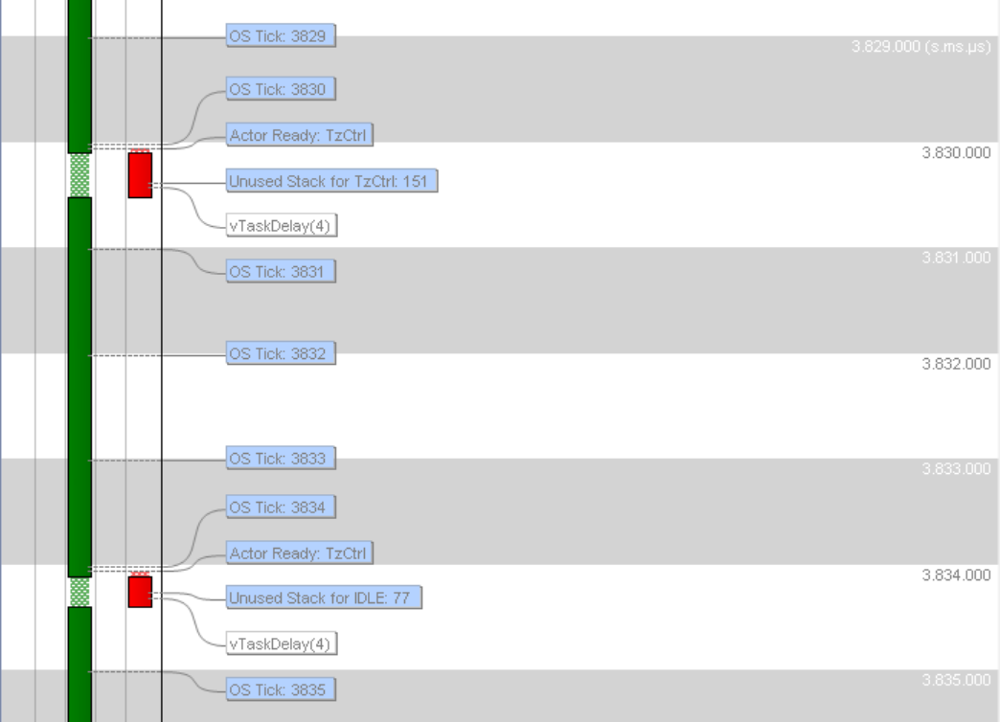
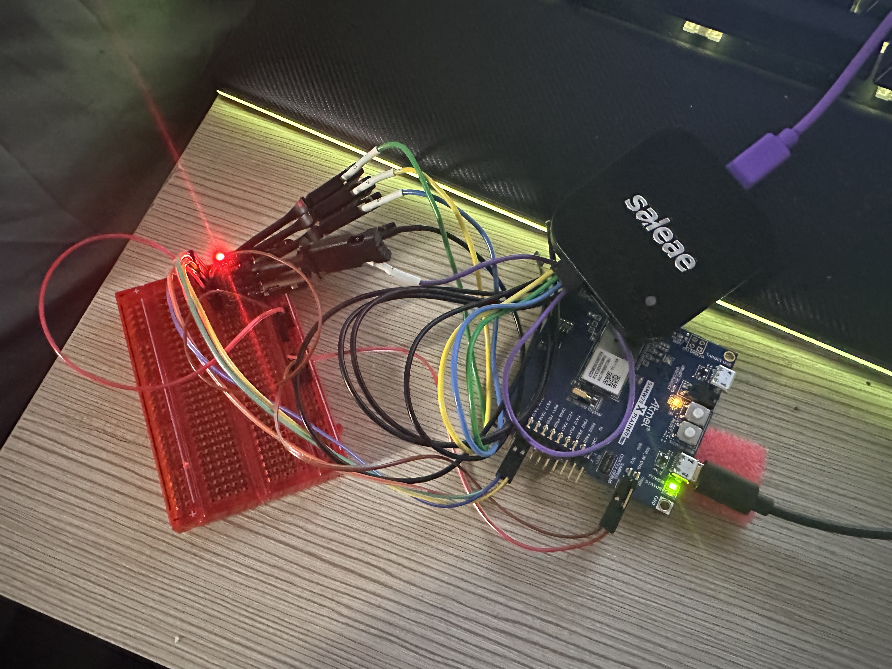
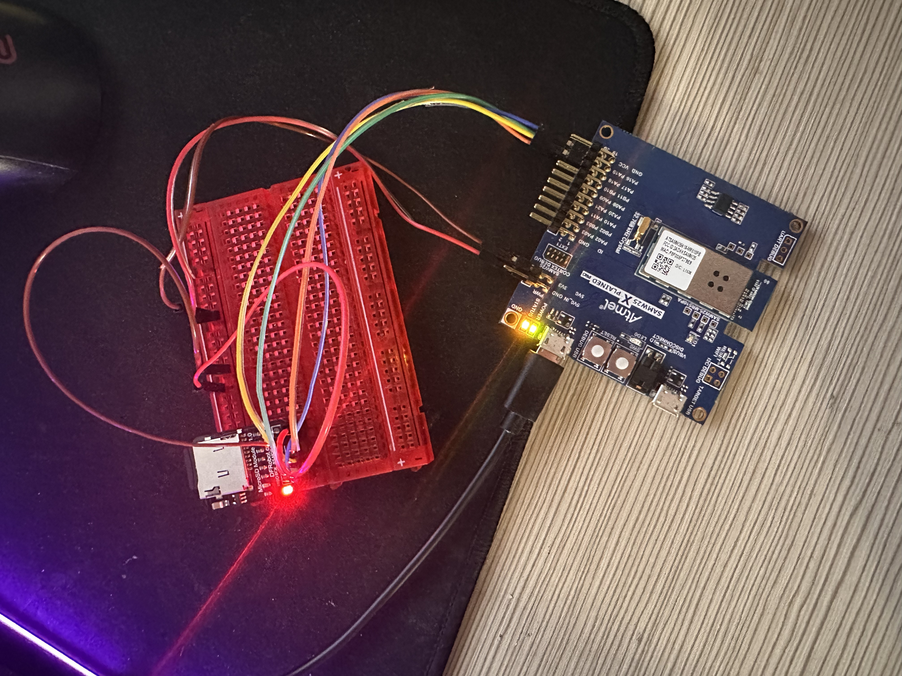
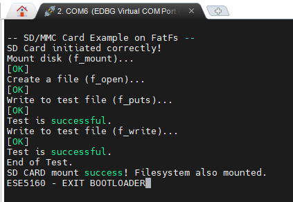
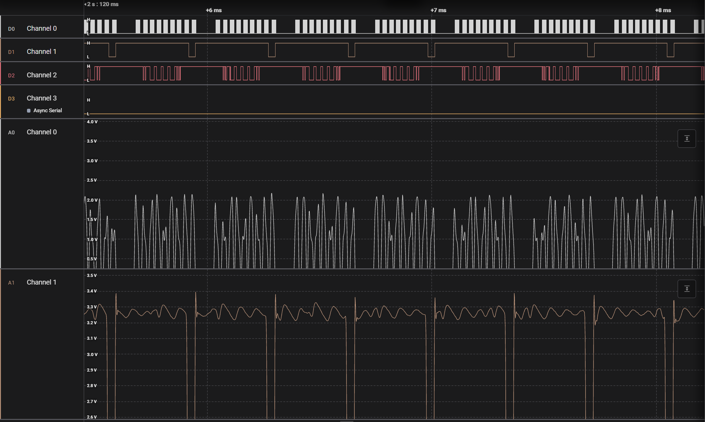

# A08G The Bootloader Waltz

```
Team Number: 21
Team Name: pixel & circuit
Team Members: Zhongyu Wang, Linhai Deng
GitHub Repository URL: https://github.com/ese5160/final-project-t21-pixel-circuit.git
Description of test hardware: (development boards, sensors, actuators, laptop + OS, etc) laptop
```

## 1. Using Percepio

1. 

## 2. Capture SD Card Comms









## 3. Bootloader Design

**1. How the Bootloader Works**

- Initialization

Initialize clock, serial console, and SD card interface. Enable global interrupts if necessary.

Optionally print “Entering Bootloader” for debugging.

- Mount the SD Card

Attempt to mount the file system on the SD card (e.g., using FatFS).

If mounting fails, you can either retry, show an error message, or simply skip updates.

- Check for New Firmware

Typically, look for a known filename (e.g., “app.bin”) on the SD card. If it doesn’t exist, assume no update is needed.

- (Optional) Validate the Firmware

For safety or security, check the file’s size, version, or CRC/signature.

If validation fails, don’t overwrite the old firmware.

- Erase the Target Flash Region

Before writing a new firmware, erase the portion of flash where your main application resides (e.g., from 0x12000 onward). Ensure you erase enough space to accommodate the new firmware.

- Write the Firmware to Flash

Read the new firmware from the SD card in small chunks (e.g., one page at a time).

Use the MCU’s NVM (flash) driver to write each chunk to the application area (starting at 0x12000).

- (Optional) Verify Written Firmware

After writing completes, you may read back or compute a CRC to confirm data integrity.

- Deinitialize Bootloader Resources

Shut down or reset any peripherals used by the bootloader (e.g., SD interface, serial console) so they won’t conflict with your main application.

- Jump to the Application

Move the vector table offset (SCB->VTOR) to the start address (0x12000).

Set the main stack pointer using the value at 0x12000.

Jump to the application’s reset handler, located at 0x12004.

**2. Flow Chart of the Bootloader Implementation**


## 4. Bootloader Implementation

I have upload to github

## 5. CRC checks

I have upload to github

https://youtube.com/shorts/qvQ75yN1lQ0?feature=share
