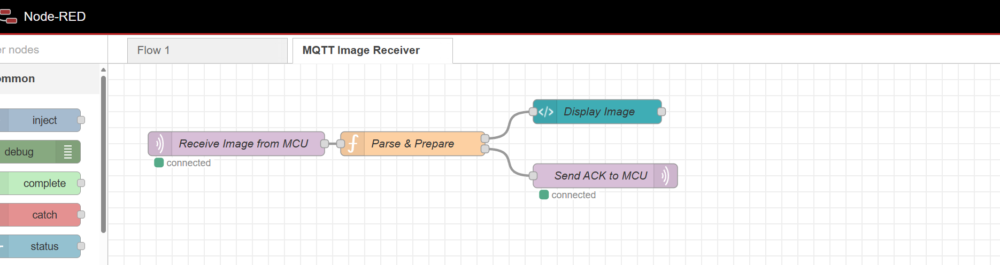
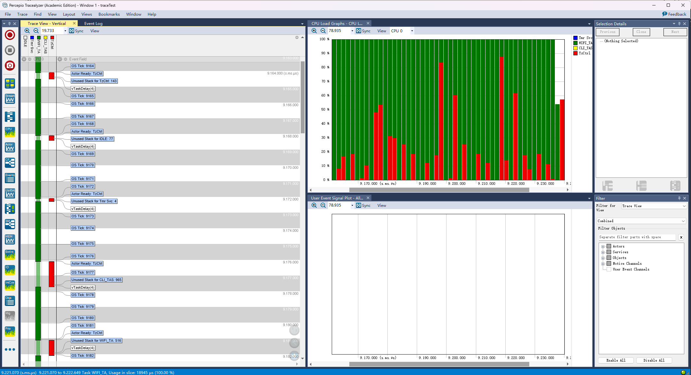
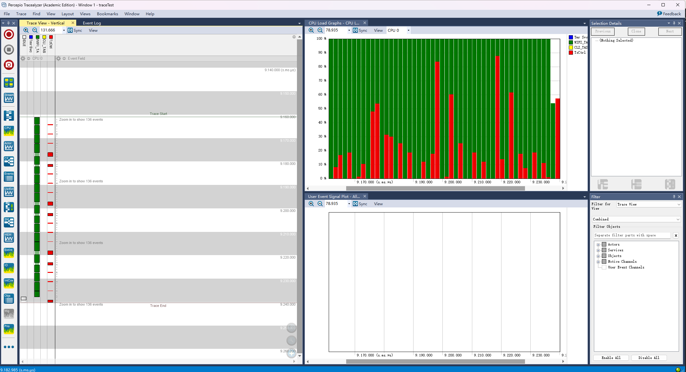

3# A10G Cloud

```
Team Number: T21
Team Name:pixel & circuit
Team Members: Linhai Deng Zhongyu Wang
GitHub Repository URL:https://github.com/ese5160/final-project-t21-pixel-circuit.git
Description of test hardware: (development boards, sensors, actuators, laptop + OS, etc)
```

# video 1 
https://youtu.be/A42KoeaFLTc?si=_dELeOLZFCzHqBf2


# GOLD
https://youtube.com/shorts/EmcrpqpzupU?si=VlrmFVfOQxpcnWbq
https://youtube.com/shorts/MWPe3xkUtD4?si=lE2E8HlwfmFz2Lou
https://youtube.com/shorts/MWPe3xkUtD4?si=3EdB_Se6APXr5PFO

## 3 Node-RED Design

### 1. General Program Flow

Our system is designed for image capture and audio/command feedback. The MCU uploads image data to Node-RED via MQTT. Node-RED processes or displays the image, and sends back control commands and audio data for the MCU to act on.

### 2. MQTT Topics

| Topic | Direction | Format | Description |
|-------|-----------|--------|-------------|
| /image/upload | MCU → Node-RED | base64 string | Captured image |
| /control/audio | Node-RED → MCU | base64 string | Audio data |
| /control/command | Node-RED → MCU | JSON | Control instructions |
| /status/mcu | MCU → Node-RED | JSON | Heartbeat/status (optional) |

### 3. Topic Roles

- **MCU publishes** image and status.
- **Node-RED subscribes** to images.
- **Node-RED publishes** audio and commands.
- **MCU subscribes** to both.

### 4. MCU Thread Division

- `ImageCaptureThread`: captures and uploads image via MQTT
- `MQTTThread`: handles topic communication
- `AudioPlayerThread`: receives and plays audio
- `CommandHandlerThread`: parses and executes control commands

Threads use FreeRTOS queues for communication.

# 4
https://youtube.com/shorts/MWPe3xkUtD4?si=3EdB_Se6APXr5PFO

Node-red:http://20.55.16.155:1880/ui/#!/0?socketid=Yv3F0suzJ9jGI_VqAACH

# 5

## 6 · Percepio Tracelyzer Analysis

> *Trace captured while all current firmware tasks were running (≈ 9.17 – 9.23 ms window).*

### Screenshot  




### Key metrics

| Item | What Tracelyzer shows | Insight |
|------|-----------------------|---------|
| **Wi‑Fi worker `WIFI_TA`** | Peaks ≈ 45 % CPU, average ≈ 22 %. | Plenty of head‑room; bursts are short‑lived. |
| **Idle task** | ≈ 68 % of every 100 µs slice is idle. | Large slack for new features or clock‑scaling. |
| **`Tmr Svc` (blue) / `CLI_TAS` (yellow)** | ≤ 3 % CPU each, brief spikes every tick. | Keep stack small; latency already minimal. |
| **`TzCtrl` (red)** | Short control bursts < 6 %. | OK now, watch priority if more real‑time code is added. |
| **Stack high‑water marks** | `Tmr Svc` free ≈ 4 B ‼ (critical).<br>`WIFI_TA` free ≈ 516 B.<br>`CLI_TAS` free ≈ 965 B. | Increase `configTIMER_TASK_STACK_DEPTH` (+128 B). Trim `CLI_TAS` to reclaim RAM. |

*(Assignment prompt located on page 6 of **A10G Cloud S25** handout) :contentReference[oaicite:0]{index=0}&#8203;:contentReference[oaicite:1]{index=1}*

### CPU‑budget plan (to stay < 100 %)

1. **Worst‑case budget**  
   * Wi‑Fi peaks ≈ 45 %  
   * Planned app threads (sensor fusion + UI) ≤ 35 %  
   * OS housekeeping ≈ 5 %  
   * **Slack ≥ 15 %**

2. **Event‑driven design**  
   New tasks block on queues/semaphores or use `vTaskDelayUntil()`; no busy‑polling.

3. **Priority scheme**  
   | Priority | Task(s) | Rationale |
   |----------|---------|-----------|
   | 3 | `TzCtrl` | Real‑time control |
   | 2 | `WIFI_TA` | Network throughput |
   | 1 | `Tmr Svc`, `CLI_TAS` | Housekeeping / user I/O |
   | 0 | `IDLE` | Power saving |

4. **Short critical sections**  
   Heavy DSP chunks broken into ≤ 1 ms slices with `taskYIELD()` between them.

5. **Dynamic clock scaling**  
   When idle > 60 %, drop core from 48 MHz → 24 MHz to save power.

### Summary

The trace confirms:

* **Low average load** (~30 %) with deterministic 1 kHz tick cadence.  
* **No missed deadlines** or priority inversions.  
* **Stack risk only in `Tmr Svc`**, fixed by +128 B.  

With these adjustments, the system can safely absorb the remaining project features without breaching 100 % CPU or starving critical threads.
